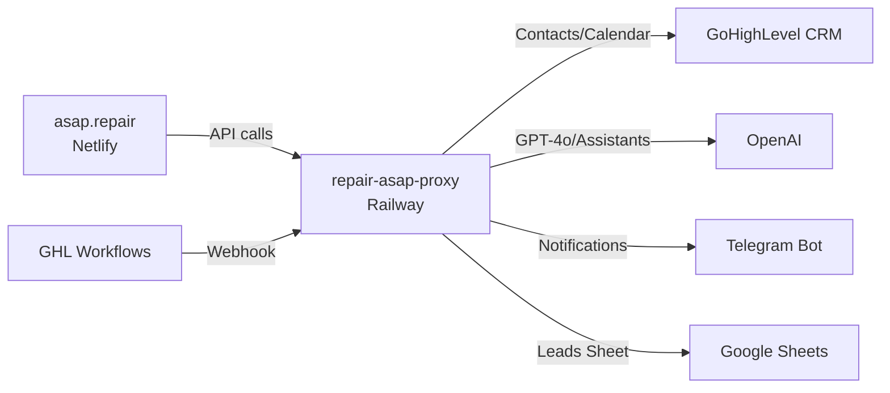

# Аудит Proxy Server: repair-asap-proxy (Railway)

## Архитектура



**Интеграции:** GHL CRM, OpenAI (Assistants + GPT-4o), Telegram, Google Sheets, GHL Calendar

**Env-переменные (8 штук):**
`OPENAI_API_KEY`, `OPENAI_ASSISTANT_ID`, `PROSBUDDY_API_TOKEN`, `PROSBUDDY_LOCATION_ID`, `GOOGLE_SHEET_ID`, `GOOGLE_SERVICE_ACCOUNT_CREDENTIALS`, `TELEGRAM_BOT_TOKEN`, `TELEGRAM_ADMIN_ID`

---

## 🔴 Критические проблемы (сервер не работает)

### 1. Node 16 → `fetch is not defined`

**Файлы с `fetch()`:**

| Файл | Строки | Что делает |
|---|---|---|
| [api/index.js](file:///Users/nikita/Developer/repair-asap-proxy/api/index.js) | 69, 94, 533 | Telegram, check-customer |
| [api/quote.js](file:///Users/nikita/Developer/repair-asap-proxy/api/quote.js) | множество | GHL pipeline, upload, conversations |
| [lib/calendarService.js](file:///Users/nikita/Developer/repair-asap-proxy/lib/calendarService.js) | 30, 126 | Calendar free-slots, bookAppointment |
| [lib/crmService.js](file:///Users/nikita/Developer/repair-asap-proxy/lib/crmService.js) | 31 | Contact upsert |
| [lib/ai-hub.js](file:///Users/nikita/Developer/repair-asap-proxy/lib/ai-hub.js) | 42 | ghlRequest helper |

**Причина:** Node 16 не имеет глобального `fetch()`. Railway задеплоил на Node 16.20.2.

**Решение:** ✅ Уже подготовлено (но не запушено):
- [package.json](file:///Users/nikita/Developer/repair-asap-proxy/package.json): engines `>=16` → `>=18`
- [.node-version](file:///Users/nikita/Developer/repair-asap-proxy/.node-version): `18`
- [nixpacks.toml](file:///Users/nikita/Developer/repair-asap-proxy/nixpacks.toml): `nodejs-18_x`

### 2. Нет `app.listen()` — сервер не стартует на Railway

**Проблема:** [api/index.js](file:///Users/nikita/Developer/repair-asap-proxy/api/index.js) заканчивается на:
```javascript
module.exports = app; // строка 729
```

На **Vercel** это работает (serverless: каждый запрос создаёт новый инстанс). На **Railway** `node api/index.js` запускает файл, но без `app.listen()` процесс завершается мгновенно — HTTP-сервер не слушает порт.

**Решение:** Добавить в конец [api/index.js](file:///Users/nikita/Developer/repair-asap-proxy/api/index.js):
```javascript
// Railway / standalone mode
if (require.main === module) {
    const PORT = process.env.PORT || 3000;
    app.listen(PORT, () => {
        console.log(`Server running on port ${PORT}`);
    });
}
module.exports = app;
```
> `require.main === module` — запускает listen только при прямом запуске (`node api/index.js`), не при `require()` из тестов.

---

## 🟡 Средние проблемы

### 3. ROLLBACK.md ссылается на Vercel
[ROLLBACK.md](file:///Users/nikita/Developer/repair-asap-proxy/ROLLBACK.md) упоминает "Vercel Environment Variables" — нужно обновить на Railway.

### 4. Telegram env переменная: `TELEGRAM_CHAT_ID` vs `TELEGRAM_ADMIN_ID`
- ROLLBACK.md документирует `TELEGRAM_CHAT_ID` (строка 119)
- Код использует `TELEGRAM_ADMIN_ID` (api/index.js строки 66, 82)

**Нужно проверить:** какая переменная реально установлена на Railway. Если `TELEGRAM_CHAT_ID` — переименовать на `TELEGRAM_ADMIN_ID`.

### 5. CORS origins не включают Railway домен
[lib/config.js](file:///Users/nikita/Developer/repair-asap-proxy/lib/config.js) (строка 16-22):
```javascript
const ALLOWED_ORIGINS = [
  'https://asap.repair',
  'https://www.asap.repair',
  'https://api.asap.repair',
  'https://sitehandy.netlify.app',
  'http://localhost:3000',
  'http://127.0.0.1:5500',
];
```
Домен Railway (`repair-asap-proxy-production.up.railway.app`) не нужен в CORS (API не вызывается с самого себя), но если есть webhook-тестирование из браузера — может понадобиться.

---

## 🟢 Мелкие проблемы

### 6. [vercel.json](file:///Users/nikita/Developer/repair-asap-proxy/vercel.json) остался в проекте
Файл не нужен на Railway и может запутать. Рекомендую удалить или оставить (Railway его игнорирует).

### 7. Комментарий в [api/index.js](file:///Users/nikita/Developer/repair-asap-proxy/api/index.js) строка 45
```javascript
// Serverless lambdas stay warm for minutes, enough for a chat session
```
На Railway это постоянный сервер, не serverless lambda. Комментарий устарел.

---

## Полный Implementation Plan

### Файлы к изменению:

#### [MODIFY] [index.js](file:///Users/nikita/Developer/repair-asap-proxy/api/index.js)
Добавить `app.listen()` перед `module.exports`:
```diff
+// Railway / standalone mode
+if (require.main === module) {
+    const PORT = process.env.PORT || 3000;
+    app.listen(PORT, () => {
+        console.log(`Server running on port ${PORT}`);
+    });
+}
 module.exports = app;
```

#### [READY] [package.json](file:///Users/nikita/Developer/repair-asap-proxy/package.json)
✅ Уже изменён: `engines.node` → `>=18.0.0`

#### [READY] [.node-version](file:///Users/nikita/Developer/repair-asap-proxy/.node-version)
✅ Уже создан: содержит `18`

#### [READY] [nixpacks.toml](file:///Users/nikita/Developer/repair-asap-proxy/nixpacks.toml)
✅ Уже создан: `nodejs-18_x`

### Шаги для выполнения:

```bash
cd /Users/nikita/Developer/repair-asap-proxy

# 1. Добавить app.listen() в api/index.js
# (см. diff выше — перед строкой module.exports = app)

# 2. Закоммитить и запушить
git add -A
git commit -m "Fix Railway: add app.listen() + bump Node to 18

Critical fixes for Railway migration:
1. Add app.listen(PORT) — Railway needs it to start the server
   (Vercel used serverless, no listen needed)
2. Bump Node to 18 — fixes 'fetch is not defined'
   (global fetch() requires Node 18+)"
git push
```

### Верификация:

```bash
# После push подождать 2-3 минуты на Railway deploy, затем:

# 1. Health check
curl https://repair-asap-proxy-production.up.railway.app/api/health

# 2. Calendar slots
curl "https://repair-asap-proxy-production.up.railway.app/api/calendar-slots?date=2026-03-12"

# 3. Chatbot thread
curl -X POST https://repair-asap-proxy-production.up.railway.app/api/thread

# 4. Check Telegram notification arrived
```
